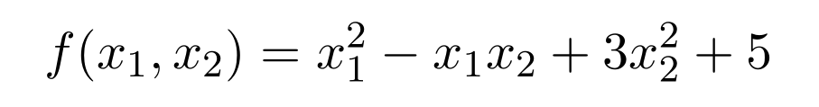
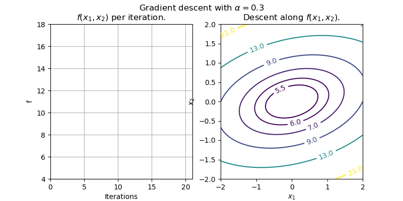
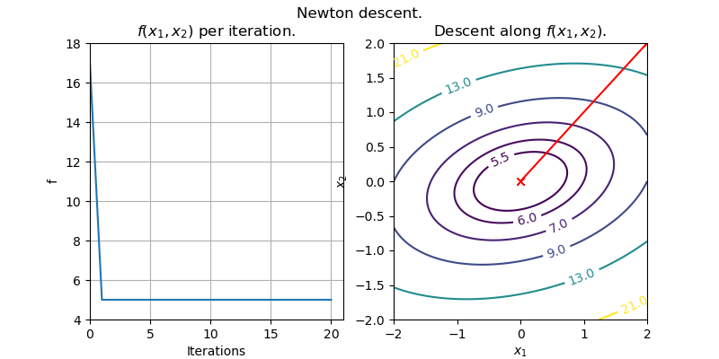

# Search and Optimization Library
This library and accompanying visualizations were created as a final project for UCSD's CSE 257: Search and Optimization

Automatically generated documentation is available in the `docs` folder,
although the code itself has comments and might be easier to read.

# Algorithm Visualizations

### Gradient Descent
Optimizing  using gradient descent.

### Newton Descent
Optimizing  using gradient descent.

The algorithm converges in one step because the function is quadratic.

### Conjugate Descent
#### Currently Work-in-Progress

### Simulated Annealing
#### Currently Work-in-Progress

### Cross-Entropy Methods
#### Currently Work-in-Progress

### Search Gradient
#### Currently Work-in-Progress

### A* search
#### Currently Work-in-Progress

### Minimax search
#### Currently Work-in-Progress

### RRT (rapidly-exploring random trees)
#### Currently Work-in-Progress

### Value iteration
#### Currently Work-in-Progress

### Policy iteration
#### Currently Work-in-Progress

### Monte Carlo Policy Evaluation
#### Currently Work-in-Progress

### Temporal Difference Policy Evaluation
#### Currently Work-in-Progress

### Tabular Q Learning Deep Q learning
#### Currently Work-in-Progress

### PPO (Proximal Policy Optimization)
#### Currently Work-in-Progress

### Monte Carlo Tree Search
#### Currently Work-in-Progress

### DPLL
#### Currently Work-in-Progress

### CDCL SAT solving
#### Currently Work-in-Progress

